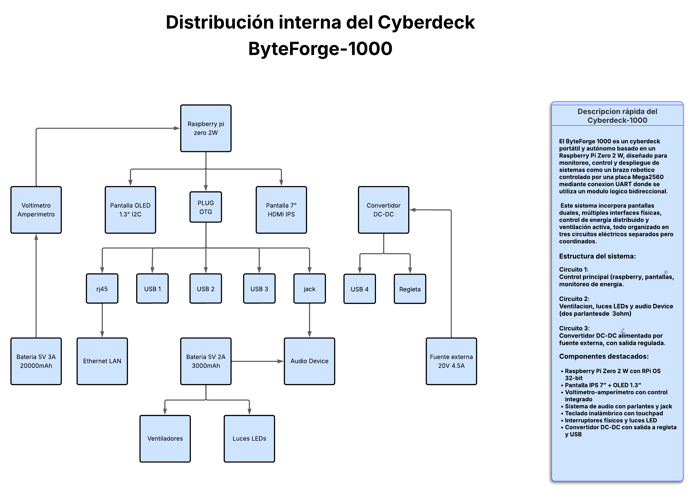

# Arquitectura del Cyberdeck ByteForge 1000

## Circuito 1: Raspberry Pi + pantallas
- Raspberry Pi Zero 2 W
- Pantalla IPS 7"
- Pantalla OLED 1.3"
- Batería 5V 3A 20,000mAh
- Interruptores: uno para la pantalla, uno de 3 posiciones (sistema, voltímetro, amperímetro)

## Circuito 2: Sistema de ventilación y sonido
- Batería 5V 2A 3000mAh
- 2 ventiladores (100mA)
- LEDs decorativos
- 2 parlantes 3W con jack y USB

## Circuito 3: Alimentación externa con convertidor DC-DC
- Fuente 20V 4.5A
- Convertidor con display de voltaje/corriente/potencia
- Regleta y USB de salida

